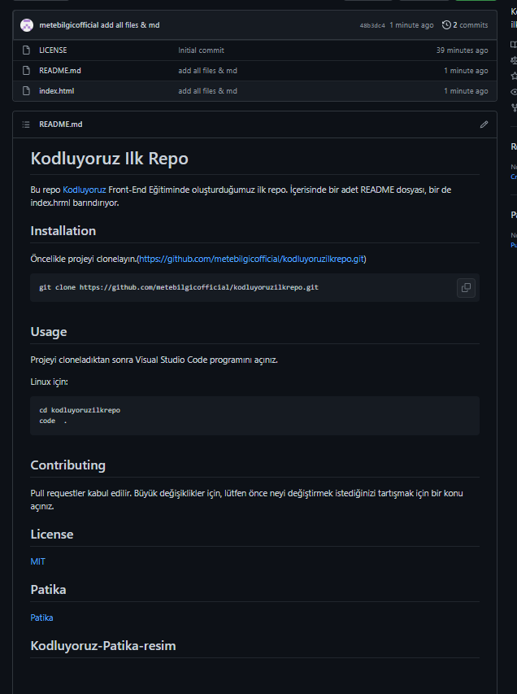

# Kodluyoruz Ilk Repo
Bu repo [Kodluyoruz](https://kodluyoruz.org/tr/kodluyoruz/) Front-End Eğitiminde oluşturduğumuz ilk repo. İçerisinde bir adet README dosyası, bir de index.html barındırıyor.

## Installation
Öncelikle projeyi clonelayın.(https://github.com/metebilgicofficial/kodluyoruzilkrepo.git)

```
git clone https://github.com/metebilgicofficial/kodluyoruzilkrepo.git
```

## Usage
Projeyi cloneladıktan sonra Visual Studio Code programını açınız.

Linux için:

```
cd kodluyoruzilkrepo
code  .
```

## Contributing

Pull requestler kabul edilir. Büyük değişiklikler için, lütfen önce neyi değiştirmek istediğinizi tartışmak için bir konu açınız.

## License

[MIT](https://tr.wikipedia.org/wiki/MIT_Lisans%C4%B1)

## Patika

[Patika](https://www.patika.dev/tr)

## Kodluyoruz-Patika-resim

